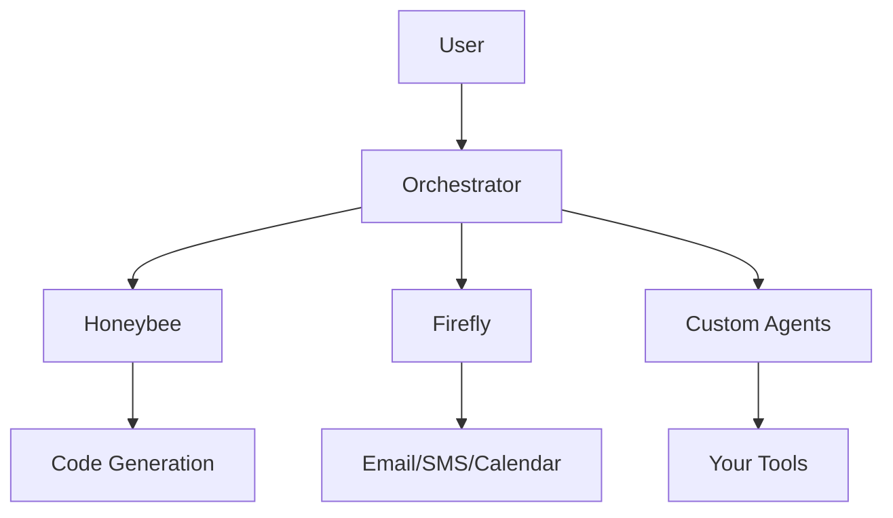

# 🌱 Quantum Garden - AI Agent Orchestration Platform

> Build your own AI workforce. No GUI required.

[](https://opensource.org/licenses/MIT)
[](https://www.python.org/downloads/)
[](http://makeapullrequest.com)

## What is Quantum Garden?

Quantum Garden is an open-source platform for orchestrating AI agents that work together like a well-coordinated team. Inspired by Walt Disney's creative process and Elon Musk's first-principles thinking, it enables you to build an AI workforce that handles complex workflows without constant human intervention.

### 🎥 Demo: Firefly Managing Email Without GUI


*Watch Firefly handle email management entirely from the command line - no browser needed!*

## ✨ Key Features

- **Agent Orchestration**: Coordinate multiple AI agents working together
- **No GUI Philosophy**: Everything works from the terminal
- **MCP Integration**: Connect to any tool via Model Context Protocol
- **Extensible**: Build your own agents using our framework
- **Production Ready**: Built for real work, not just demos

## 🚀 Quick Start

```bash
# Clone the repository
git clone https://github.com/msimka/quantum-garden.git
cd quantum-garden

# Install dependencies
pip install -r requirements.txt

# Run your first agent
python -m quantum_garden.agents.firefly email cleanup
```

## 🐛 The Agent Ecosystem

Our agents are inspired by insects - small, specialized, and incredibly effective when working together:

### Core Agents (Open Source)

- **🍯 Honeybee** - The Builder: Manages development and architecture
- **✨ Firefly** - The Communicator: Handles all messaging and time-based tasks
- **🎵 Earwig** - The Music Producer: Controls DAWs and audio production
- **🦗 Mantis** - The Sales Agent: Manages referrals and revenue

### Premium Agents (Enterprise)

- **🕷️ Spider** - Advanced web automation
- **🦋 Butterfly** - Social media management
- **🐜 Ant** - Task decomposition and delegation

## 💡 Philosophy

> "Make it work, make it right, make it fast" - Kent Beck

We believe AI should augment human capability, not replace it. Quantum Garden gives you superpowers while keeping you in control.

## 🛠️ Architecture



## 📚 Documentation

- [Getting Started](docs/getting-started.md)
- [Building Your First Agent](docs/first-agent.md)
- [Architecture Overview](docs/architecture.md)
- [API Reference](docs/api.md)

## 🤝 Contributing

We love contributions! See [CONTRIBUTING.md](CONTRIBUTING.md) for guidelines.

### Good First Issues

- [ ] Add Slack integration to Firefly
- [ ] Create agent template generator
- [ ] Improve error messages
- [ ] Add more examples

## 🏢 Enterprise

Need enterprise features? Check out [Quantum Garden Enterprise](https://eliaslabs.com/quantum-garden):

- 🔐 Advanced security and compliance
- ☁️ Cloud synchronization
- 🎯 Premium agents
- 📞 Priority support

## 📈 Roadmap

- [x] Core orchestration engine
- [x] Basic agent implementations
- [ ] Plugin marketplace
- [ ] Visual workflow designer (optional GUI!)
- [ ] Mobile app

## 🙏 Acknowledgments

Built with Claude (Anthropic), inspired by open source giants like Odoo, and powered by the amazing AI community.

## 📄 License

MIT License - see [LICENSE](LICENSE) for details.

---

**Built by [Mychal Simka](https://github.com/msimka) at [Elias Labs](https://eliaslabs.com)**

*Star ⭐ this repo if you find it useful!*